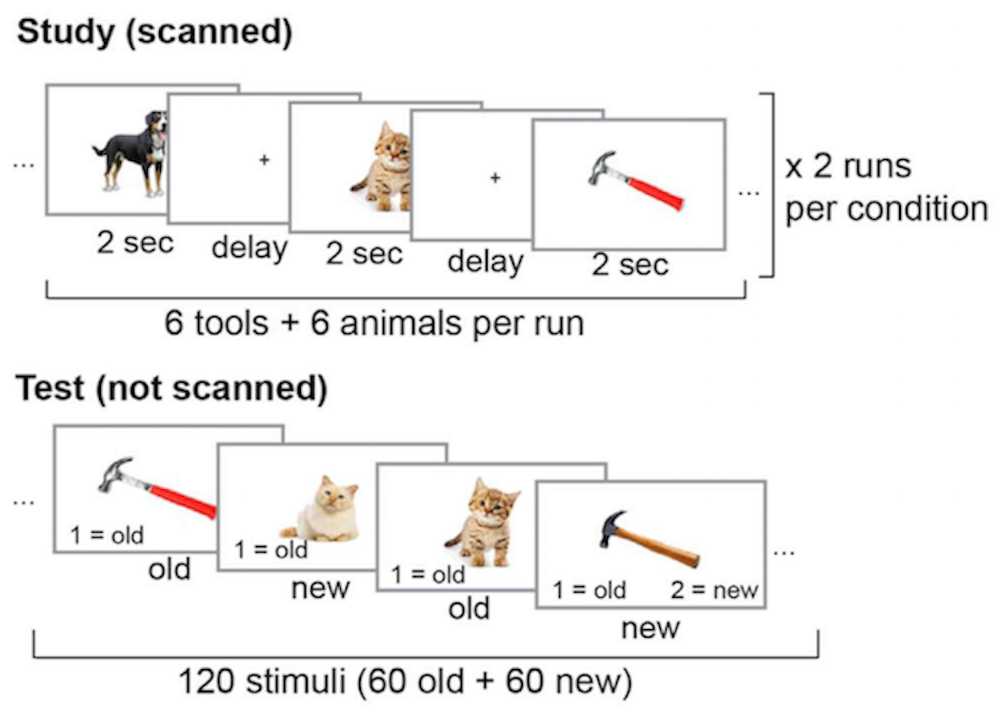
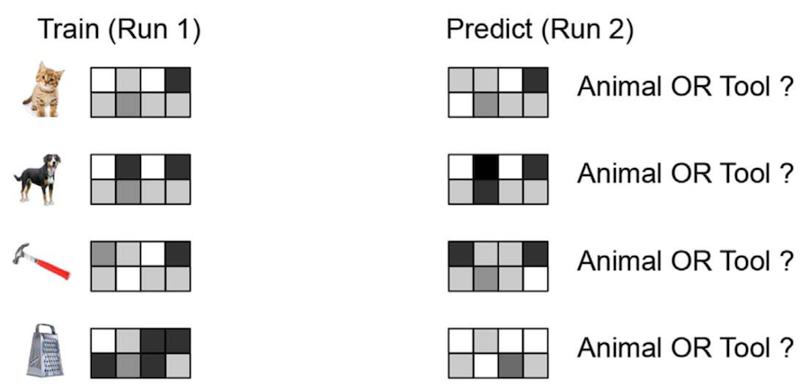

```{r setup, include=FALSE}
library(flexdashboard)
library(tidyverse)
library(lurr)
library(patchwork)
library(ggsci)

## load data
cat <- rio::import("models/decodeCat_results.rds")

mem <- rio::import("models/decodeMem_results.rds") %>%
  mutate(subClass = fct_recode(subClass,
                               remembered = "class2",
                               forgotten = "class1")) %>% 
  # average across ROIs, cannot average across timing conditions
  group_by(ssid, timing, nremembered, nforgotten, subClass) %>% 
  summarize(acc = mean(acc),
            hit_class1 = mean(hit_class1),
            hit_class2 = mean(hit_class2),
            fa_class1 = mean(fa_class1),
            fa_class2 = mean(fa_class2),
            .groups = "keep")

```


Decoding Category {.storyboard}
=======================================================================

```{r}
# Calculating the average decoding accuracy for each trial timing condition
cat_acc <- cat %>% 
  mutate(ratio = fct_relevel(ratio, ".5:.5", after = 2),
         roi = fct_relevel(roi, c("lo","pfus","ipar"))) %>% 
  group_by(ratio, timing) %>% 
  summarize(m_acc = mean(acc),
            se_acc = se(acc),
            .groups = "keep")

# Calculating the decoding accuracy across all conditions
cat_acc_avg <- cat_acc %>% 
  group_by(ratio) %>% 
  summarize(se_acc = se(m_acc),
            m_acc = mean(m_acc),
            .groups = "keep")

```

```{r}
# calculating the mean hit and fa rate for smaller and larger classes
cat_sub <- cat %>% 
  filter(subClass != "none") %>% 
  mutate(hit_small = ifelse(subClass=="class1", 
                          hit_class1, hit_class2),
         hit_large = ifelse(subClass=="class1",
                         hit_class2, hit_class1),
         fa_small = ifelse(subClass=="class1",
                        fa_class1, fa_class2),
         fa_large = ifelse(subClass=="class1",
                        fa_class2, fa_class1)) %>% 
  pivot_longer(cols = c(11:14),
               names_to = c("resp_type","class_size"),
               names_sep = "_",
               values_to = "rate")

cat_sub <- cat_sub %>% 
  group_by(ratio, timing, resp_type, class_size) %>% 
  summarize(m_rate = mean(rate),
            se_rate = se(rate),
            .groups = "keep")

# averaging across trial timing conditions 
cat_sub_avg <- cat_sub %>% 
  group_by(ratio, resp_type, class_size) %>% 
  summarize(se_rate = se(m_rate),
            m_rate = mean(m_rate),
            .groups = "keep")

```

```{r}
# Calculating the mean hit and false alarm rates for each category
cat_resp <- cat
names(cat_resp)[7:10] <- c("oanimal_panimal","otool_ptool","otool_panimal","oanimal_ptool")
cat_resp <- cat_resp %>% 
  # add category labels to subClass variabel
  mutate(subClass = ifelse(subClass == "class1","animal",
                           ifelse(subClass == "class2","tool",
                                  "none"))) %>% 
  pivot_longer(cols = c(7:10),
               names_to = c("observed","predicted"),
               names_sep = "_",
               values_to = "rate") %>%
  # remove the first letter
  mutate(observed = str_sub(observed, 2),
         predicted = str_sub(predicted, 2)) %>% 
  group_by(ratio, timing, roi, subClass, observed, predicted) %>% 
  summarize(m_rate = mean(rate),
            se_rate = se(rate),
            .groups = "keep")

# Calculating the mean hit and false alarm rates across all conditions
cat_resp_avg <- cat_resp %>% 
  group_by(ratio, subClass, observed, predicted) %>% 
  summarize(se_rate = se(m_rate),
            m_rate = mean(m_rate),
            .groups = "keep")
```

In the present report, I tested the effect of unequal or unbalanced classes on MVPA performance. For the first classification problem, a support vector machine (SVM) model was trained to differentiate between patterns of brain activity when a participant is viewing an animal v. tool. For more information about the SVM models, please see the `About` page. Class sizes in the training data were manually adjusted to the following ratios - 2:3, 1:2, 1:3. These were compared to two balanced conditions- 1:1 and .5:.5. The 1:1 condition contained all observations for both classes. The .5:.5 condition was included to compare the effect of downsampling to balance the class sizes with fewer observations. 

### Classification accuracy decreases as classes become more unbalanced

```{r, fig.width=8}
lab_colors <- c("olivedrab","indianred","olivedrab","indianred","indianred")

cat_acc_avg %>% 
  mutate(group = 1) %>% 
  ggplot(aes(x = ratio, y = m_acc)) +
  geom_pointrange(aes(ymin = m_acc-se_acc, ymax = m_acc+se_acc), 
                  size = 1.1, fatten = 3) +
  geom_line(aes(group = group), size = 1.1) +
  geom_hline(aes(yintercept = .5), 
             linetype = "dashed") + 
  annotate(geom = "text", y = .51, x = 1.1, 
           label = "Chance Performance", size = 3) +
  labs(title = "Classification accuracy across ratios",
       x = "Ratio of Class Sizes",
       y = "Classification Accuracy") +
  ylim(c(.5,.8)) +
  theme_light(base_size = 20) +
  theme(axis.text.x = element_text(color = lab_colors),
        axis.text.y = element_text(color = "black"),
        title = element_text(size = 20))

```

***
Classification performance decreases as the class sizes become more unbalanced, though accuracy remains above chance for all ratio conditions (indicated by dashed line). Importantly, classification accuracy in the `.5:.5` ratio condition was worse than in the other balanced `1:1` condition, suggesting that downsampling was not a viable solution when the number of observations per class was so small. 

### Decreases in classification accuracy do not differ between trial timing conditions

```{r, fig.width=9}
cat_acc %>% 
  mutate(group = 1) %>% 
  ggplot(aes(x = ratio, y = m_acc, color = timing)) +
  geom_pointrange(aes(ymin = m_acc-se_acc, ymax = m_acc+se_acc),
                  size = 1.1, fatten = 3) +
  geom_line(aes(group = timing), size = 1.1) +
  geom_hline(aes(yintercept = .5), 
             linetype = "dashed") + 
  annotate(geom = "text", y = .51, x = 1.1, 
           label = "Chance Performance", size = 3) +
  labs(title = "Classification accuracy across ratios",
       x = "Ratio of Class Sizes", y = "Classification Accuracy",
       color = "Trial Timing Condition") +
  ylim(c(.5,.8)) +
  theme_light(base_size = 20) +
  theme(axis.text.x = element_text(color = lab_colors),
        axis.text.y = element_text(color = "black"),
        title = element_text(size = 20)) +
  scale_color_brewer(type = "qual", palette = "Paired")

```

***
When I broke classification accuracy down by trial timing condition, I saw a similar decrease in performance as the classes became more unbalanced. This decrease was similar across trial timing conditions. 


### Ratio of class sizes biases predictions

```{r, fig.width=10}
cat_sub_avg %>% 
  ungroup() %>% 
  mutate(class_size = fct_relevel(class_size, c("small","large")),
         resp_type = fct_relevel(resp_type, c("hit","fa"))) %>% 
  ggplot(aes(x = class_size, y = m_rate, fill = resp_type)) +
  geom_bar(stat = "identity",
           position = position_dodge(width = .9)) +
  geom_linerange(aes(ymin = m_rate-se_rate, ymax = m_rate+se_rate),
                 position = position_dodge(width = .9)) +
  facet_wrap(~ratio) +
  labs(title = "Classification Performance for Smaller v. Larger Classes",
       x = "Class Size", y = "Rate of Response", fill = "Response Type") +
  theme_light(base_size = 20) +
  theme(title = element_text(size = 20)) +
  scale_fill_brewer(palette = "Set2")
  
```

***
To evaluate bias in the classifier, I next looked at the hit rate and false alarm rate split by the larger v. smaller class. As the class sizes became more unbalanced, the hit and false alarm rates for larger class increased while the hit and false alarm rates for the smaller class decreased. This suggests that bias in the classifier to predict the larger class increased as the classes become more imbalanced. 


### Bias in classifier did not differ between trial timing conditions

```{r, fig.width=10}
cat_sub %>% 
  ungroup() %>% 
  mutate(class_size = fct_relevel(class_size, c("small","large")),
         resp_type = fct_relevel(resp_type, c("hit","fa"))) %>% 
  ggplot(aes(x = class_size, y = m_rate, fill = resp_type)) +
  geom_bar(stat = "identity",
           position = position_dodge(width = .9)) +
  geom_linerange(aes(ymin = m_rate-se_rate, ymax = m_rate+se_rate),
                 position = position_dodge(width = .9)) +
  facet_grid(timing~ratio) +
  labs(title = "Classification Performance for the Smaller v. Larger Classes",
       x = "Class Size", y = "Rate of Response", fill = "Response Type") +
  theme_light(base_size = 20) +
  scale_fill_brewer(palette = "Set2") +
  theme(title = element_text(size = 20))
  
```

***
The classifier's bias towards predicting the larger class was consistent across trial timing conditions. All timing conditions showed a similar increase in bias as the classes became more unbalanced.


### Bias in the classifier does not differ between the categories

```{r, fig.width = 10}
layer1 <- cat_resp_avg %>% 
  # filter out unbalanced classes and hits
  filter(subClass == "none" & 
           observed == predicted) %>% 
  ggplot(aes(x = subClass, y = m_rate, fill = predicted)) +
  geom_bar(stat = "identity", 
           position = position_dodge(width = .9)) +
  geom_linerange(aes(ymin = m_rate-se_rate, ymax = m_rate+se_rate),
                 position = position_dodge(width = .9)) +
  facet_wrap(~ratio) +
  labs(x = "Balanced Classes", y = "False Alarm Rate") +
  guides(fill = "none") +
  theme(axis.text.x = element_blank(),
        axis.ticks.x = element_blank()) +
  ylim(c(0,1)) +
  theme_light(base_size = 20) +
  scale_fill_npg()

layer2 <- cat_resp_avg %>% 
  # filter out balanced classes and hits
  filter(subClass != "none" & 
           observed == predicted) %>% 
  ggplot(aes(x = subClass, y = m_rate, fill = predicted)) +
  geom_bar(stat = "identity", 
           position = position_dodge(width = .9)) +
  geom_linerange(aes(ymin = m_rate-se_rate, ymax = m_rate+se_rate),
                 position = position_dodge(width = .9)) +
  facet_wrap(~ratio) +
  labs(x = "Smaller Class", y = NULL, fill = "Prediction") +
  ylim(c(0,1)) +
  theme_light(base_size = 20) +
  scale_fill_npg()

layer1 + layer2 + 
  plot_layout(widths = c(1,2)) +
  plot_annotation(title = "False Alarm Rate by Stimulus Category",
                  theme = theme(title = element_text(size = 20)))
```

***
I then broke down the false alarm rate when each category served as the smaller class. In the balanced conditions, there was no bias to false alarm to one category over the other. This was true even in the `.5:.5` ratio condition, even though overall accuracy of the classifier suffered. There was a similar effect in the unbalanced conditions, with false alarm rates comparable between the two categories.


Decoding Memory {.storyboard}
=======================================================================

For the second classification problem, a support vector machine (SVM) model was trained to differentiate between patterns of brain activity associated with remembered v. forgotten trials. For more information about the SVM models, please see the `About` page. As people retain information at different rates, this allowed me to probe the effect of unequal class sizes in a real-world example. 

```{r}
# calculate a corrected hit rate
mem <- mem %>% 
  rowwise() %>% 
  mutate(hit = mean(c(hit_class1,hit_class2), na.rm = TRUE),
         fa = mean(c(fa_class1, fa_class2), na.rm = TRUE),
         chr = hit - fa)

# tidy to get classification responses
mem_resp <- mem
names(mem_resp)[7:10] <- c("oforgotten_pforgotten", "oremembered_premembered",
                           "oremembered_pforgotten", "oforgotten_premembered")
mem_resp <- mem_resp %>% 
  filter(!is.na(subClass)) %>% 
  pivot_longer(cols = c(7:10),
               names_to = c("observed","predicted"),
               names_sep = "_",
               values_to = "rate") %>% 
  # remove the first letter
  mutate(observed = str_sub(observed, 2),
         predicted = str_sub(predicted, 2)) %>% 
  group_by(subClass, timing, observed, predicted) %>% 
  summarize(m_rate = mean(rate),
            se_rate = se(rate),
            .groups = "keep")

mem_resp_avg <- mem_resp %>% 
  group_by(subClass, observed, predicted) %>% 
  summarize(se_rate = se(m_rate),
            m_rate = mean(m_rate),
            .groups = "keep")
```


### Classification performance is better when more trials are remembered

```{r, fig.width=10}
mem %>% 
  ggplot(aes(x = nremembered, y = chr)) +
  geom_vline(xintercept = 6, linetype = "dashed",
             color = "olivedrab", size = .2) +
  annotate(geom = "text", x = 7.7, y = -.4,
           label = "Balanced Classes",
           color = "chartreuse4", size = 3) +
  geom_point() +
  geom_smooth(method = "lm", color = "black") +
  labs(title = "Classification Performance by Number of Remembered Trials",
       x = "Number of Remembered Trials",
       y = "Corrected Hit Rate\n(hit rate - fa rate)") +
  facet_wrap(~timing) +
  theme_light(base_size = 16) +
  theme(title = element_text(size = 16))
  
```

***
I first looked at how classification performance changed as a function of the number of trials remembered. Note that as the number of remembered trials increase, the classes (remembered v. forgotten) become more unbalanced. Balanced class sizes (number of remembered trials = 6) are marked in green. Since the classes in the testing set were also imbalanced, corrected hit rate (hit rate - false alarm rate) was used to index classification performance. Unexpectedly, as the number of remembered trials increased 


### Bias in the classifier was present with balanced classes and worsened with more remembered trials

```{r, fig.width=10}
mem_resp_avg %>% 
  mutate(subClass = fct_recode(subClass, balanced = "none")) %>% 
  ggplot(aes(x = observed, y = m_rate, fill = predicted)) +
  geom_bar(stat = "identity",
           position = position_dodge(width = .9)) +
  geom_linerange(aes(ymin = m_rate-se_rate, ymax = m_rate+se_rate),
                 position = position_dodge(width = .9)) +
  labs(title = "Classification Responses for the Smaller Class",
       x = "Observed Class", y = "Rate of Response",
       fill = "Predicted Class") +
  facet_wrap(~subClass) +
  theme_light(base_size = 16) +
  theme(title = element_text(size = 16)) +
  scale_fill_npg()

```

***
I then looked at classification responses when there were fewer forgotten trials (panel 1), fewer remembered trials (panel 2), or an equal number of forgotten v. remembered trials (panel 3). Importantly, even when the classes were balanced, there was a bias in the classifier to predict trials were remembered. This bias persisted when there were more remembered trials than forgotten ones. 


### False alarm rate for both classes decreases as class sizes become more unbalanced

```{r}
# not including any stat testing for now, need to talk with advisor first
# mem %>% 
#   mutate(bias = fa_class2 - fa_class1) %>% 
#   group_by(timing) %>% 
#   summarize(cortest = list(broom::tidy(cor.test(nremembered, bias))),
#             .groups = "keep") %>% 
#   unnest(cortest)
```


```{r, fig.width=10}
mem %>% 
  mutate(bias = fa_class2 - fa_class1) %>% 
  ggplot(aes(x = nremembered, y = bias)) +
  geom_vline(xintercept = 6, linetype = "dashed",
             color = "olivedrab", size = .2) +
  annotate(geom = "text", x = 7.75, y = -.39,
           label = "Balanced Classes",
           color = "chartreuse4", size = 3) +
  geom_point(size = .75, position = "jitter", alpha = .5) +
  geom_smooth(method = "lm", size = .75, color = "black") +
  labs(title = "False Alarm Rate by Number of Remembered Trials",
       x = "Number of Remembered Trials",
       y = "Classifier Bias\n(fa remembered - fa forgotten)") +
  facet_wrap(~timing) +
  theme_light(base_size = 16) +
  theme(title = element_text(size = 16))
```

***
Finally, I looked at the change in bias as the number of remembered trials increased. Bias was measured by the rate at which the classifier false alarmed to one class over the other, specifically the false alarm rate for remembered trials - false alarm rate for gotten trials. Visual inspection of the graphs show that bias increased as the number of remembered trials increased for the quick6 and the slow12 trial timing conditions. In other words, as the number of remembered trials increased and the classes become more imbalanced, the classifier is more likely to false alarm and predict remembered trials. The quick4n trial timing condition appeared to be more robust against this bias.


About 
=======================================================================

Row 
-----------------------------------------------------------------------

### Background 

In functional MRI multivoxel pattern analysis (MVPA), we are sometimes faced with classification problems where the training set contains unequal class sizes. For example, if we are trying to predict activity for remembered v. forgotten pictures, we may find that there are more remembered than forgotten trials. Unequal observations between the classes may bias the classifier to predict the more frequently observed class. In other words, if trained on more “remembered” trials, the classifier may be more likely to predict trials in the untrained set as “remembered.” While downsampling is a common solution to unequal class sizes, it’s not always an ideal approach when working with fMRI data. The available training data in MVPA is often small and downsampling can exacerbate this problem. This report is intended to showcase the influence of unbalanced or unequal class sizes on MVPA performance and show how downsampling is not always the solution. I will highlight two classification problems, one with manually produced imbalance and another with inherent imbalance.  


Row 
-----------------------------------------------------------------------

### About the Data

The data was taken from a previously conducted study that tested the effects of trial timing on fMRI pattern analysis (Zeithamova et al., 2017). While undergoing MRI, participants intentionally encoded pictures of animals and tools. The encoding task was run using five different trial timing conditions with two blocks or runs per condition (10 runs total). The data from three of the trial timing conditions were using in this report: jittered 4-8 s trials (quick4n), 6 s trials (quick6), 12 s trials (slow12). In each run, participants studied 12 pictures (6 animals + 6 tools). Following the MRI scan, memory for the items were tested in an old v. new recognition task. 


### Task Design

```{r}

```

Row 
-----------------------------------------------------------------------

### Multivoxel Pattern Analysis (MVPA) 

For the first classification problem, I trained an support vector machine (SVM) to differentiate between patterns of brain activity when a participant is viewing an animal v. tool (decoding category). In this problem, the number of observations for animals and tools in the training data were manually adjusted to the following ratios - 2:3, 1:2, 1:3. Each category (animal v. tool) served as the smaller class. Observations for the smaller class were randomly sampled and used to train the SVM model. This sampling process was repeated 5 times. These were compared to two balanced conditions- 1:1 and .5:.5. The 1:1 condition contained all observations for both classes. The .5:.5 condition was included to compare the effect of downsampling to equal class sizes but with half of the available observations. 

In the second classification problem, I trained an SVM to differentiate the patterns of brain activity associated with remembered v. forgotten trials. This type of classification problem often produces unequal class sizes as people differ in how well they can remember information. 

Brain activity for each trial was first estimated using general linear model. Estimates of brain activity across voxels (i.e., 3D pixels) were vectorized to serve as the "features" or input to the SVM models. I used linear SVM from the `e1071` package, with the default C = 1. Univariate feature selection was used to select the top 100 voxels. The model was trained using a leave-one-run-out cross-validation approach.

### MVPA Overview

```{r}

```